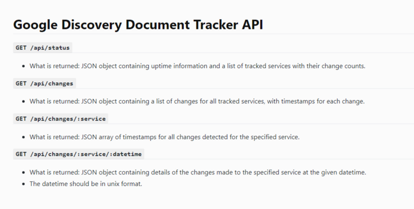

# discovery-tracker

Tracker for changes in [Google Discovery Documents](https://developers.google.com/discovery) with optional Discord webhook support written in Rust.



### Installation via Docker (linux/wsl)

Install docker via the instructions at https://docs.docker.com/engine/install/

```
git clone https://github.com/ddd/discovery-tracker
cd discovery-tracker
```

Modify the config as necessary

```
vim config.yaml
```

Start the container

```
sudo docker compose up -d
```

The local API will be available at http://localhost:3000
